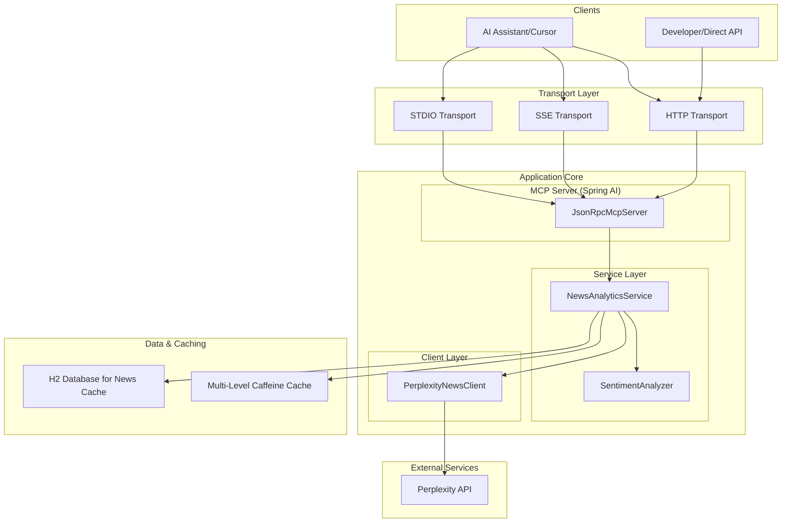

# System Patterns: Crypto News MCP Server

## 1. System Architecture

## 2. Key Design Patterns

- **Service-Oriented Architecture**: The application is divided into distinct services (`NewsAnalyticsService`, `SentimentAnalyzer`, `PerplexityNewsClient`), each with a clear responsibility.
- **Dependency Injection**: Spring framework is used extensively to manage dependencies between components.
- **Repository Pattern**: A `NewsItemRepository` will be used to abstract the data access layer, even if it's just for caching to an H2 database.
- **Function Callbacks**: Spring AI's `FunctionCallback` and `FunctionCallbackWrapper` are the primary mechanism for exposing business logic as tools to the MCP clients.
- **Builder Pattern**: The `CryptoAnalytics` model object will use a builder for clean and readable construction.
- **Caching**: Multi-level caching (`news-cache`, `sentiment-cache`, `analytics-cache`) is used to improve performance and reduce API calls. 